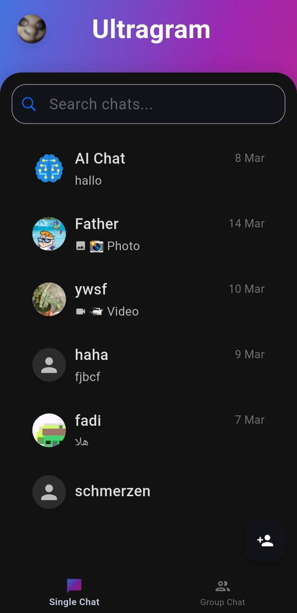
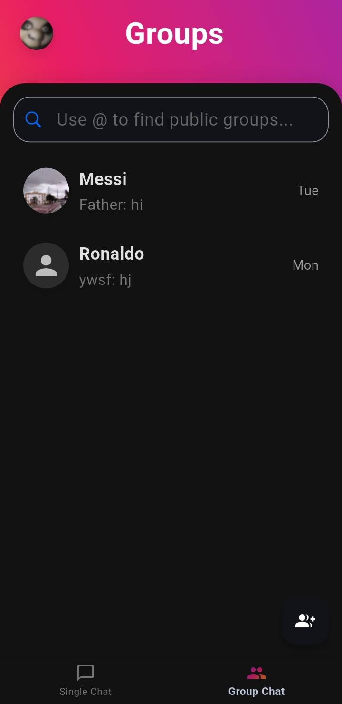
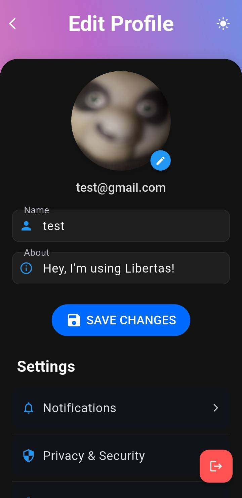
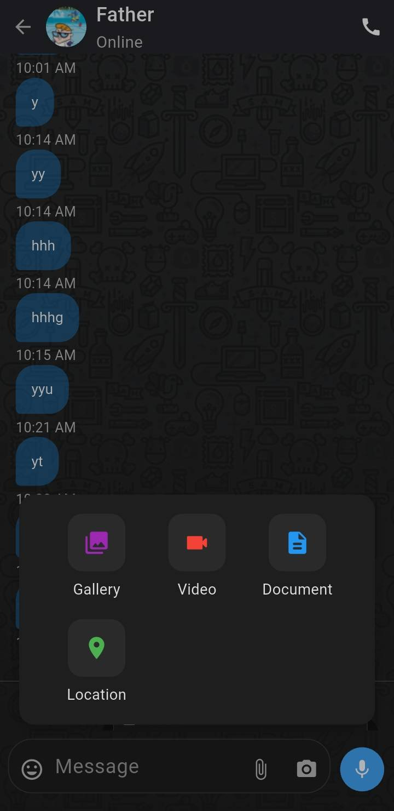
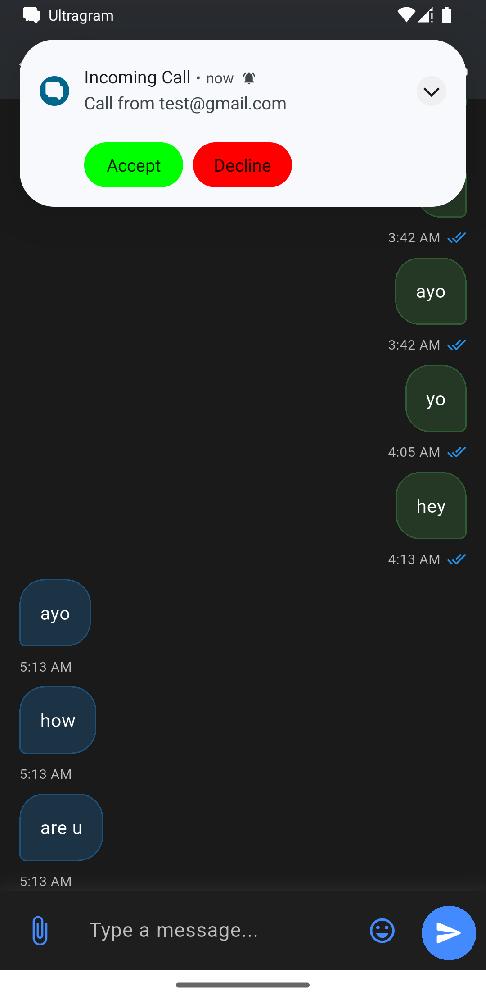

# Ultragram - Secure Messaging App

## Features
- **End-to-End Encrypted Messaging**
- **P2P Video Calling** - Direct peer-to-peer video calls for enhanced privacy
- **Group Chats** with reply functionality
- **Media Sharing** - Send images, videos, and documents
- **Privacy & Security Settings**
- **Real-time Message Updates**

## Screenshots

### Chat Interface

### Group Chat

### Profile Screen

### Chat Screen

### Video Call

### 

## Getting Started

### Prerequisites
- Flutter SDK
- Android Studio / VS Code
- Firebase account
- Web storage for media files

### Setup
1. Clone the repository
2. Set up a Firebase project:
   - Create a new Firebase project at [firebase.google.com](https://firebase.google.com)
   - Enable Authentication (Email/Password)
   - Set up Cloud Firestore database
   - Set up Firebase Storage
   - Download and add the google-services.json file to the android/app directory
3. Set up web storage:
   - You need a web server with PHP support for media file uploads
   - Update the upload URL in the app configuration
4. Replace placeholder API keys in the following files:
   - `lib/api/notification_access_token.dart`
   - `lib/api/apis.dart`
   - `lib/services/signalling/signalling_service.dart`
   - `lib/screens/ai_screen.dart`
   - `android/app/google-services.json`
5. Run `flutter pub get` to install dependencies
6. Run `flutter run` to start the app

## Support and Guidance
If you need guidance on setting up or using this application, please contact me at [https://x.com/Hundle_o](https://x.com/Hundle_o).

## Update Log - Group Chat Enhancements  

### 🛠 Fixes  
- **Fixed Group Chat Reply Functionality**  
  - Resolved issues with message replies not displaying correctly.  
  - Improved threading behavior for better user experience.  

- **Fixed Group Message Update Issue**  
  - Ensured messages update properly in real-time.  
  - Addressed inconsistencies in message synchronization.  

- **Fixed Group Screen Reload Issue**  
  - Resolved unexpected reloads when navigating between group chats.  
  - Optimized screen refresh behavior for stability.  

### ✨ Enhancements  
- **Group Chat Screen Enhancement**  
  - Improved UI/UX for a smoother group chat experience.  
  - Added minor design tweaks for better readability and usability.  

- **Updated Group API Sorting Mechanism**  
  - Enhanced sorting logic to display messages in the correct order.  
  - Improved efficiency in retrieving and displaying group conversations.  

